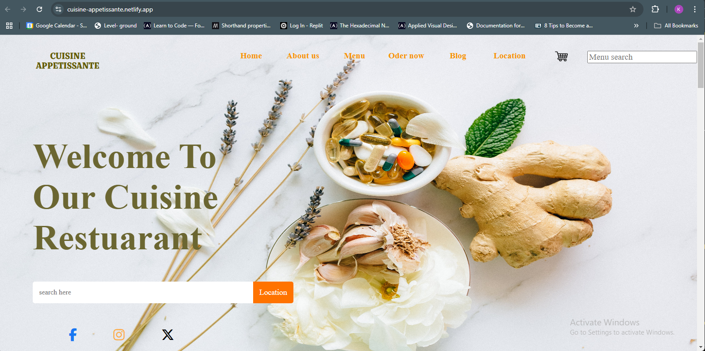

## Project Name

**CUISINE-APPETISSANTE**

[]

## Project Description

A restaurant app that shows the cuisine menu and details about the resaurant.

## Built With

- HTML, CSS, and Javascript
- Visual Studio Code
- Chrome Developer Tools
- following github flows standards.

## Getting Started

**This project works on all screens .**

---

To get a local copy up and run:

- git clone https://github.com/kelwilson/cuisine-appetissante.git in your terminal

### Prerequisites

- Git/Github
- VSCode or another equivalent tool
- knowledge in HTML, CSS, and Javascript

### LIVE DEMO

Check the live demo here [LINK](https://cuisine-appetissante.netlify.app)

## Author

👤 **KELWILSON**

- GitHub: [@githubhandle](https://github.com/kelwilson)
- Twitter: [@BesongMaris](https://twitter.com/BesongMaris)
- LinkedIn: [@LinkedIn](https://www.linkedin.com/in/kelly-besong-b33074237/)

## Show your support

Give a ⭐️ if you like this project!

## 📝 License

This Project Is Not licensed.